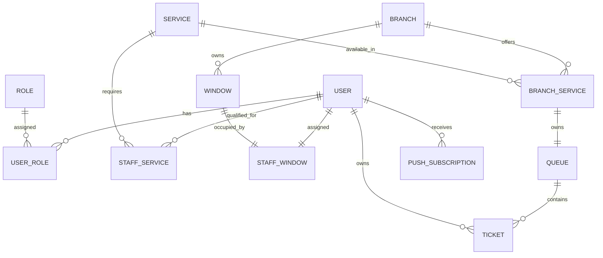

# Government Queue Tracking Platform

Version: MVP 1.0

---

# 1. Purpose

This document defines the database entities, attributes, relationships, and cardinality rules for the Government Queue Tracking Platform.

The ERD serves as the source of truth for database implementation.

---

# 2. Core Domain Overview

The platform revolves around:

```text
Branches
    ↓
Services
    ↓
Queues
    ↓
Tickets
```

while users interact with the system through role-based permissions.

---

# 3. Entities

---

## User

Represents all authenticated users in the platform.

### Attributes

| Field              | Type           |
| ------------------ | -------------- |
| id                 | UUID           |
| full_name          | VARCHAR        |
| phone_number       | VARCHAR UNIQUE |
| preferred_language | ENUM(ar,en)    |
| is_active          | BOOLEAN        |
| created_at         | TIMESTAMP      |
| updated_at         | TIMESTAMP      |

---

## Role

Defines system permissions.

### Attributes

| Field | Type    |
| ----- | ------- |
| id    | UUID    |
| name  | VARCHAR |

### Seed Data

```text
Citizen
DoorKeeper
CounterStaff
BranchSupervisor
SystemAdmin
```

---

## UserRole

Many-to-many relationship between users and roles.

### Attributes

| Field   | Type |
| ------- | ---- |
| user_id | FK   |
| role_id | FK   |

---

## Branch

Government service branch.

### Attributes

| Field      | Type      |
| ---------- | --------- |
| id         | UUID      |
| name       | VARCHAR   |
| address    | VARCHAR   |
| is_active  | BOOLEAN   |
| created_at | TIMESTAMP |

---

## Service

Government service type.

### Attributes

| Field       | Type      |
| ----------- | --------- |
| id          | UUID      |
| name        | VARCHAR   |
| description | TEXT      |
| is_active   | BOOLEAN   |
| created_at  | TIMESTAMP |

Examples:

```text
Passport Renewal
National ID
Birth Certificate
```

---

## BranchService

Defines which services are available in which branches.

### Attributes

| Field                      | Type    |
| -------------------------- | ------- |
| id                         | UUID    |
| branch_id                  | FK      |
| service_id                 | FK      |
| estimated_duration_minutes | INTEGER |
| is_active                  | BOOLEAN |

---

## Window

Physical service window.

### Attributes

| Field         | Type    |
| ------------- | ------- |
| id            | UUID    |
| branch_id     | FK      |
| window_number | INTEGER |
| is_open       | BOOLEAN |

---

## StaffService

Defines which services a staff member can perform.

### Attributes

| Field      | Type |
| ---------- | ---- |
| id         | UUID |
| user_id    | FK   |
| service_id | FK   |

---

## StaffWindow

Current window assignment.

### Attributes

| Field       | Type      |
| ----------- | --------- |
| id          | UUID      |
| user_id     | FK        |
| window_id   | FK        |
| assigned_at | TIMESTAMP |

---

## Queue

Represents a service queue within a branch.

### Attributes

| Field                  | Type      |
| ---------------------- | --------- |
| id                     | UUID      |
| branch_service_id      | FK        |
| current_serving_number | INTEGER   |
| created_at             | TIMESTAMP |

---

## Ticket

Citizen queue ticket.

### Attributes

| Field        | Type           |
| ------------ | -------------- |
| id           | UUID           |
| queue_id     | FK             |
| citizen_id   | FK(User)       |
| queue_number | INTEGER        |
| status       | ENUM           |
| joined_at    | TIMESTAMP      |
| called_at    | TIMESTAMP NULL |
| completed_at | TIMESTAMP NULL |

---

## PushSubscription

Stores browser push notification subscriptions.

### Attributes

| Field      | Type      |
| ---------- | --------- |
| id         | UUID      |
| user_id    | FK        |
| endpoint   | TEXT      |
| p256dh_key | TEXT      |
| auth_key   | TEXT      |
| created_at | TIMESTAMP |

---

# 4. Enumerations

---

## TicketStatus

```text
Waiting
Called
InProgress
Completed
Cancelled
Skipped
NoShow
```

---

## Language

```text
ar
en
```

---

# 5. Relationships

---

## User ↔ Role

Relationship:

```text
Many-to-Many
```

Implementation:

```text
UserRole
```

---

## Branch ↔ Service

Relationship:

```text
Many-to-Many
```

Implementation:

```text
BranchService
```

---

## Branch ↔ Window

Relationship:

```text
One-to-Many
```

A branch owns multiple windows.

---

## Staff ↔ Service

Relationship:

```text
Many-to-Many
```

Implementation:

```text
StaffService
```

---

## Staff ↔ Window

Relationship:

```text
One-to-One (Current Assignment)
```

Implementation:

```text
StaffWindow
```

---

## BranchService ↔ Queue

Relationship:

```text
One-to-One
```

Each:

Branch + Service

combination owns exactly one queue.

---

## Queue ↔ Ticket

Relationship:

```text
One-to-Many
```

A queue contains many tickets.

---

## Citizen ↔ Ticket

Relationship:

```text
One-to-Many
```

A citizen may own multiple historical tickets.

Only one may be active.

---

## User ↔ PushSubscription

Relationship:

```text
One-to-Many
```

A user may subscribe from multiple browsers/devices.

---

# 6. Cardinality Summary

| Relationship            | Cardinality |
| ----------------------- | ----------- |
| User → Role             | M:N         |
| Branch → Service        | M:N         |
| Branch → Window         | 1:N         |
| Staff → Service         | M:N         |
| Staff → Window          | 1:1         |
| BranchService → Queue   | 1:1         |
| Queue → Ticket          | 1:N         |
| Citizen → Ticket        | 1:N         |
| User → PushSubscription | 1:N         |

---

# 7. Mermaid ERD



---

# 8. Suggested Database Constraints

---

## Unique Phone Number

```sql
UNIQUE(phone_number)
```

---

## One Queue Per Branch Service

```sql
UNIQUE(branch_service_id)
```

---

## One Active Window Assignment

```sql
UNIQUE(user_id)
UNIQUE(window_id)
```

---

## Unique Staff Service Mapping

```sql
UNIQUE(user_id, service_id)
```

---

## Unique Branch Service Mapping

```sql
UNIQUE(branch_id, service_id)
```

---

## One Active Booking Rule

Application-level constraint:

A citizen cannot create a new ticket when an existing ticket exists with status:

```text
Waiting
Called
InProgress
```

---

# 9. Future Extensions

The following entities may be added later without redesigning the core model:

* AuditLog
* NotificationHistory
* ServiceCategories
* BranchOperatingHours
* PublicHolidayCalendar
* QueuePriorityRules
* AppointmentScheduling
* SMSNotifications

```
```
