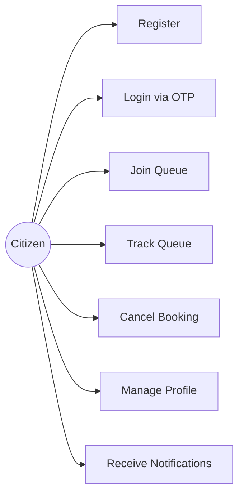
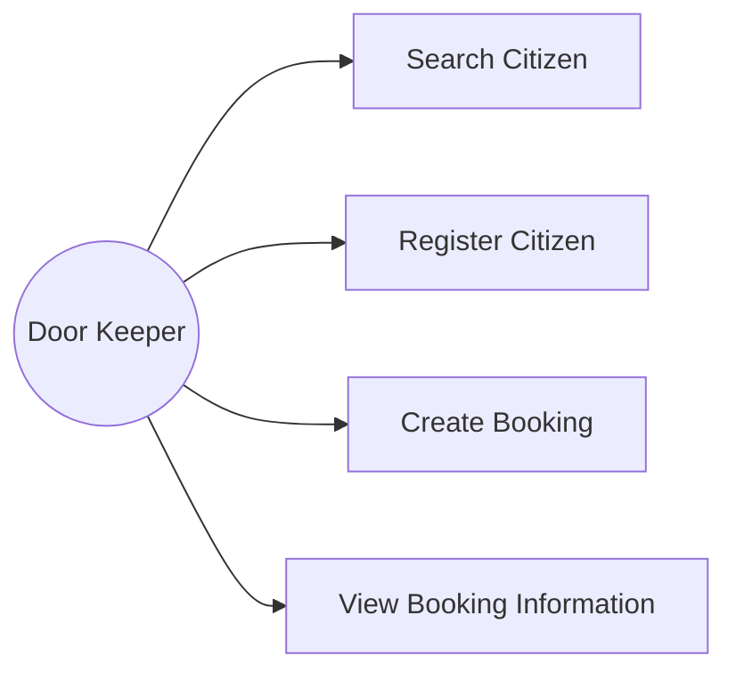
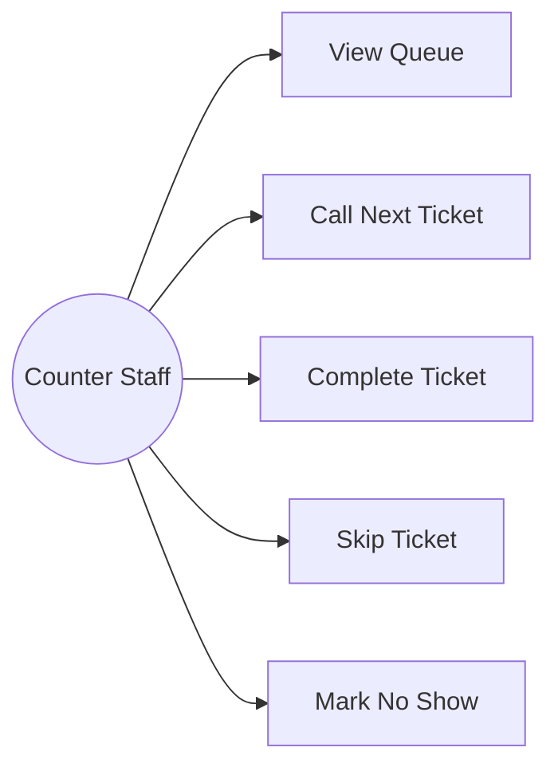
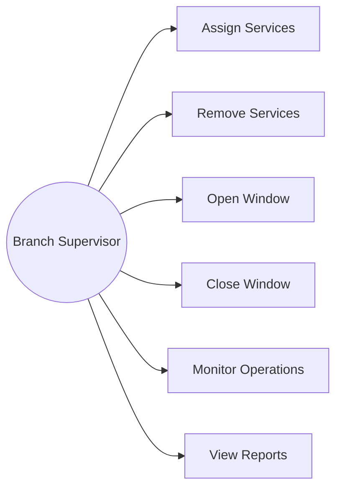
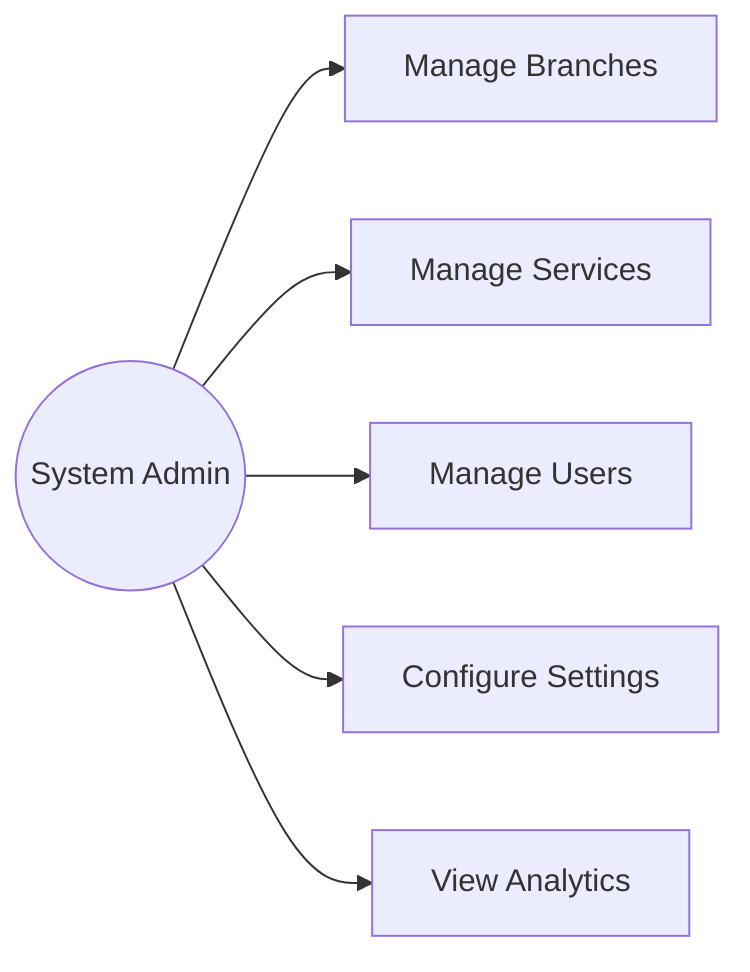
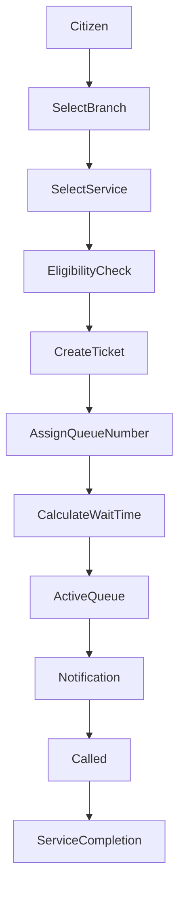

# Government Queue Tracking Platform

Version: MVP 1.0

---

# Use Case Diagrams

This document describes the primary use cases supported by the Government Queue Tracking Platform.

---

# 1. Actors

## Guest

* View branches
* View services
* View congestion levels
* View estimated waiting times

## Citizen

* Register account
* Authenticate via OTP
* Join queue
* Track queue status
* Cancel booking
* Manage profile
* Receive notifications

## Door Keeper

* Search citizen
* Register citizen
* Create booking on behalf of citizen
* View citizen booking information

## Counter Staff

* View queues
* Call next ticket
* Complete ticket
* Skip ticket
* Mark no-show

## Branch Supervisor

* Manage staff qualifications
* Manage windows
* Monitor branch operations
* View reports

## System Admin

* Manage branches
* Manage services
* Manage users
* Configure system settings
* View organization analytics

---

# 2. Citizen Use Cases

---

# 3. Door Keeper Use Cases

---

# 4. Counter Staff Use Cases

---

# 5. Branch Supervisor Use Cases

---

# 6. System Admin Use Cases

---

# 7. End-to-End Booking Flow

